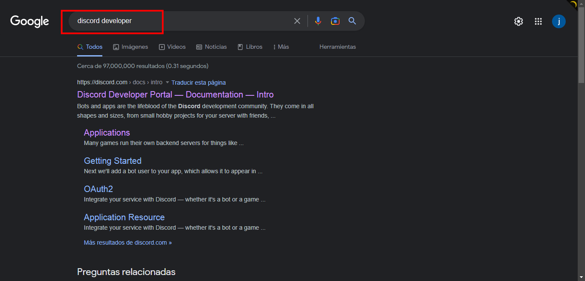

# Guia de uso para el bot de Discord

### Requisitos para instalar

* Editor de codigo. Ej: Visual Studio Code
* tener python instalado con la version 3.7
* Tener cuenta en Discord

### Requisitos para ejecutar el bot
## Debemos tener un Token para Ejecutar el bot:

1. buscar en google Discord Developer con la sesion iniciada

2. entreamos en web de discord developer y entramos en la seccion de "aplication"

3. debemos crear una aplicacion donde se alojara el bot

4. Selecionamos la aplicacion que creamos y selecionamos la seccion que dice "bot"

5. selecionamos en el apartado de "reset token"

6. abrimos visual studio y creamos un archivo ".env" en la carpeta donde se encuentra el archivo del bot

### Ejecutar el bot

1. debemos instalar las dependencias que se mostraran a continuacion: 

2. para instalar las dependencias de python usaremos el terminal de Visual Studio Code: 

3. hacemos click en el apartado que dice "Terminal"

4. escribimos el comando "pip install" y procedemos a intalar las dependencias mostradas en el paso 1

5. cuando tengamos todos los componentes de python requeridos procedemos a ejecutar el bot en el terminal:

### Comandos del bot de Discord

1. !registro: este comando le permitira registrarse en el bot
   * Ejemplo de como debe usarse: !registro Nombre correo contrasena confirmar contrasena
   * Ejemplo practico: !registro jhon correo@ejemplo.com 12345678 12345678

2. en caso de que el usuario ya este registro saldra el siguiente mensaje: 

3. el comando !eliminar permitira eliminar el usuario creado:
   * Ejemplo: !eliminar

4. el comando !inicar le permitira tener acceso a la informacion del mundial y sus equipos
  * Ejemplo: !iniciar

5. el comando !equipo muestra la informacion del equipo asi como su grupo:
  *Ejemplo: !equipo spain
